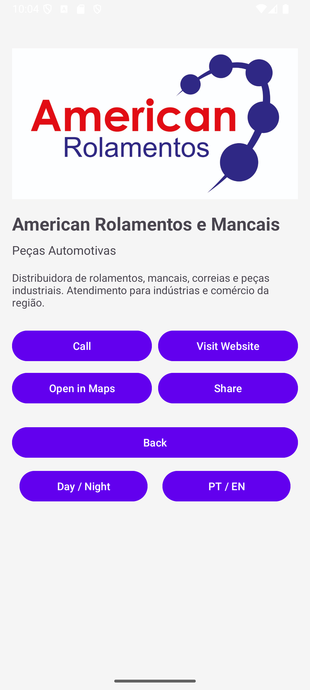
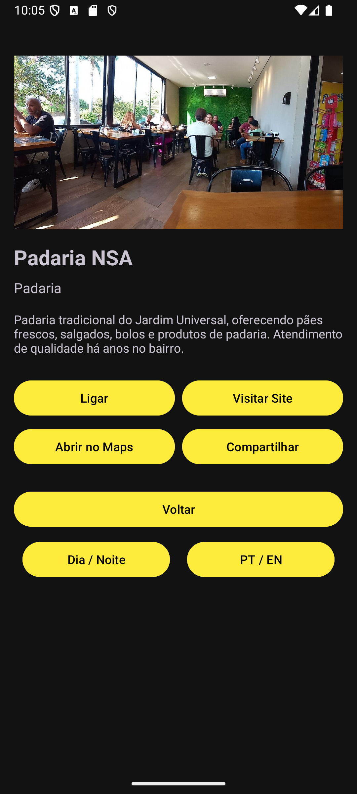
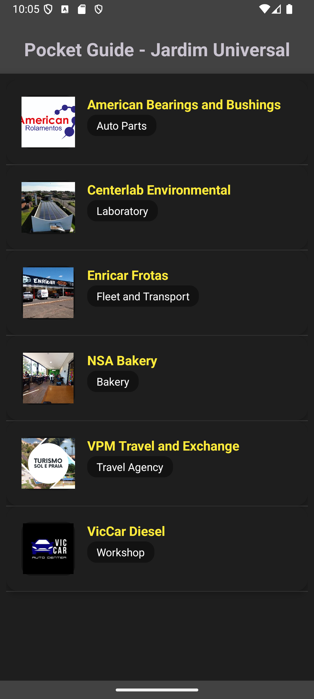

# 📱 Guia Pocket - Jardim Universal

## 📋 Descrição do Projeto
O **Guia Pocket - Jardim Universal** é um aplicativo Android desenvolvido em Kotlin que funciona como um guia comercial para o bairro Jardim Universal em Araraquara/SP. O app permite aos usuários explorar estabelecimentos locais, visualizar detalhes e acionar funcionalidades nativas como ligações, navegação e compartilhamento.

## 🎯 Funcionalidades
- ✅ **Lista de Estabelecimentos** - Visualização em cards com imagens
- ✅ **Detalhes Completos** - Informações detalhadas de cada serviço
- ✅ **Intents Nativas** - Ligação, site, maps e compartilhamento
- ✅ **Internacionalização** - Suporte a Português e Inglês
- ✅ **Modo Claro/Escuro** - Tema automático seguindo sistema
- ✅ **Interface Responsiva** - Design moderno com Material Design

## 🛠 Tecnologias Utilizadas
- **Linguagem**: Kotlin
- **Arquitetura**: MVC (Model-View-Controller)
- **UI**: XML com ViewBinding
- **Componentes**: ListView, Adapter personalizado, Intents
- **Recursos**: Internacionalização, Themes, Material Design

## 📸 Capturas de Tela

### 🌞 Modo Claro
| Português | Inglês |
|-----------|---------|
|  |  |

### 🌙 Modo Escuro  
| Português | Inglês |
|-----------|---------|
|  |  |

## 🎥 Demonstração em Vídeo
*Vídeo demonstrativo das funcionalidades do app*

## 🏢 Estabelecimentos Incluídos
- 🥖 Padaria NSA
- 🚚 Enricar Frotas  
- 🔬 Centerlab Ambiental
- 🔧 American Rolamentos
- 🚛 VicCar Diesel
- ✈️ VPM Viagens

## 📱 Funcionalidades por Tela

### Tela Principal (`MainActivity`)
- Lista rolável de estabelecimentos
- Cards com imagem, nome e categoria
- Título com tema dinâmico
- Design responsivo

### Tela de Detalhes (`DetailActivity`)  
- Imagem destacada do estabelecimento
- Informações completas (descrição, telefone, endereço)
- Botões de ação:
  - 📞 Ligar
  - 🌐 Visitar site
  - 🗺️ Abrir no Maps
  - 📤 Compartilhar
  - 🔙 Voltar
  - 🌓 Alternar tema
  - 🌐 Trocar idioma

  ## 🚀 Como Executar
1. Clone o repositório
2. Abra no Android Studio
3. Sincronize o projeto
4. Execute em um emulador ou dispositivo físico

## 📄 Licença
Este projeto foi desenvolvido para fins educacionais como parte da disciplina de Dispositivos Móveis 1.

---

**Desenvolvido por** Luiz Gustavo Monico  
**Disciplina**: Dispositivos Móveis 1  
**Instituição**: IFSP - Campus Araraquara
